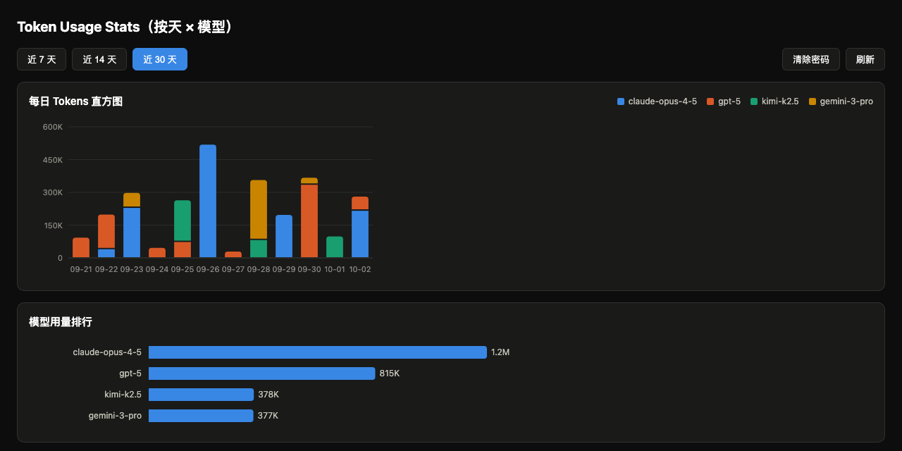

# token-usage-stats

[](https://github.com/zpvan/token-usage-stats/actions/workflows/ci.yml)
[](https://github.com/zpvan/token-usage-stats/releases)
[](go.mod)
[](LICENSE)

[CLIProxyAPI](https://github.com/router-for-me/CLIProxyAPI) 的用量统计插件：按「天 × 模型」聚合 token 用量（输入、缓存命中率、输出、TPS），本地 JSON 文件持久化最近 30 天数据。

[English README](README.md)



## ⚠️ 兼容性提示（请先读）

**官方 release 的 CPA core 目前加载任何自编译 Go 插件都会崩溃**——已在 v7.2.151 与 v8.0.11 上复现（插件 init 阶段 `fatal error: unknown caller pc` / SIGSEGV，CI 构建的 host 与插件 runtime 之间的 cgo ABI 不兼容）。

在上游修复之前，必须配合**本机源码构建的 core** 使用本插件：

```bash
git clone https://github.com/router-for-me/CLIProxyAPI.git
cd CLIProxyAPI
go build -o cli-proxy-api ./cmd/server
```

用该二进制替换 release 版 core（注意架构匹配）。上游 issue 准备中，修复后此提示将移除。

如果启动器（如 EasyCLIProxyAPI）自动更新 core 覆盖了本地构建的二进制，可运行 `make install-local-core`：从 `CPA_SRC_DIR`（默认 `../CLIProxyAPI`）重新构建 core、备份现有二进制，并连同本插件一起装入 `CPA_CORE_DIR`。

## 功能

- 每条请求完成后自动聚合：请求数、输入 tokens（含缓存口径换算）、缓存读取/写入、缓存命中率、输出 tokens（含推理）
- 每天一个 JSON 文件（`./token-usage-stats-data/YYYY-MM-DD.json`），保留最近 30 天（可配置 1-365），重启不丢
- 认证 JSON API：`GET /v0/management/usage-stats`
- 浏览器页面：`/v0/resource/plugins/token-usage-stats/stats`——每日堆叠直方图（缓存读取/非缓存输入/输出）、模型用量排行条形图 + 明细表格，四套主题与 CLIProxyAPI 管理界面一致（跟随系统/纯白/羊毛纸/暗色，同源时自动跟随管理界面主题）

## 安装

### 从 Release 下载（推荐）

从 [Releases](https://github.com/zpvan/token-usage-stats/releases) 下载对应平台的产物：

| 平台 | 产物 |
|---|---|
| macOS Apple Silicon | `token-usage-stats-vX.Y.Z-darwin-arm64.dylib` |
| macOS Intel | `token-usage-stats-vX.Y.Z-darwin-amd64.dylib` |
| Linux x86_64 | `token-usage-stats-vX.Y.Z-linux-amd64.so` |
| Linux arm64 | `token-usage-stats-vX.Y.Z-linux-arm64.so` |

拷入 CPA 插件目录（推荐按架构子目录存放）：

```bash
mkdir -p /path/to/cpa/plugins/darwin/arm64
cp token-usage-stats-vX.Y.Z-darwin-arm64.dylib /path/to/cpa/plugins/darwin/arm64/
```

### 从源码构建

需要 Go ≥ 1.23 与支持 CGO 的 C 工具链（macOS: Xcode CLT）。

```bash
make build        # 产出 bin/token-usage-stats.dylib（macOS）/ .so（Linux）
make test         # 运行单元测试
```

跨平台部署时需在目标平台重新构建。

## 部署

1. 把动态库拷入 CPA 的插件目录（CPA 会扫描 `<plugins.dir>/<goos>/<goarch>/` 与 `<plugins.dir>/`）：

   ```bash
   make install CPA_PLUGINS_DIR=/path/to/CLIProxyAPI/plugins
   ```

2. 在 CPA 的 `config.yaml` 中启用：

   ```yaml
   plugins:
     enabled: true
     configs:
       token-usage-stats:
         enabled: true
         data_dir: ./token-usage-stats-data   # 可选，默认此值
         retention_days: 30                    # 可选，默认 30（1-365）
   ```

3. 重启 CPA（或触发热重载）。

## 查看数据

### 浏览器页面

打开 `http://<cpa-host>:<port>/v0/resource/plugins/token-usage-stats/stats`，输入管理密码（Management Key）即可查看表格。密码仅保存在浏览器 localStorage。

### JSON API

```bash
curl -H "Authorization: Bearer <management-key>" \
  "http://localhost:8317/v0/management/usage-stats?from=2026-09-03&to=2026-10-02"
```

响应示例：

```json
{
  "days": [
    {
      "day": "2026-10-02",
      "models": [
        {
          "model": "gpt-5",
          "requests": 12,
          "failed_requests": 0,
          "input_tokens": 120000,
          "cache_read_tokens": 80000,
          "cache_creation_tokens": 0,
          "cache_hit_rate": 0.6667,
          "output_tokens": 8000,
          "reasoning_tokens": 2000,
          "total_tokens": 128000
        }
      ],
      "totals": { "requests": 12, "...": "..." }
    }
  ],
  "totals": { "requests": 12, "...": "..." },
  "generated_at": "2026-10-02T15:04:05+08:00"
}
```

## 口径说明

- **天**：按 CPA 运行机器的本地时区划分。
- **模型**：取请求的实际模型（`Model` → `ResponseModel` → `Alias` → `unknown`）。
- **输入 tokens（总输入）**：不同 provider 的原始 `input_tokens` 语义不同，插件统一换算——Claude 系为 `input + cache_read + cache_creation`；OpenAI/Gemini 系的 `input_tokens` 本身已含缓存，直接使用。
- **缓存命中率** = `cache_read_tokens / 输入 tokens`（输入为 0 时为 `null`）。
- **输出 tokens**：Gemini 系的推理 tokens 单独上报，已并入输出总量。
- **TPS（生成速度，tokens/秒）**：流式请求按 `输出 ÷ (Latency − TTFT)` 计算（真实吐字速度），非流式退化为 `输出 ÷ Latency`；仅统计成功且有输出的请求，无有效样本时显示 `-`。

## 开发

纯 Go 标准库，无第三方依赖。结构：

- `main.go` — C ABI 入口、信封编解码、method 分发
- `config.go` — 配置解析（flat-YAML 子集）
- `register.go` — 注册与生命周期
- `aggregator.go` — 内存聚合与 flush 生命周期
- `store.go` — 按天 JSON 持久化
- `api.go` — Management JSON API
- `page.go` — 内嵌浏览器页面
